# Compact Video Language Model (VLM) for Video Captioning

> A compact and practical Video Language Model (VLM) for automatic video captioning using a Vision Transformer (ViT) encoder and a GPT-2 language decoder, with optional LLM-based caption refinement.

---

## Overview

This repository contains the implementation of a compact Video Language Model (VLM) for video captioning. The framework combines a pretrained Vision Transformer (ViT) with a GPT-2 language decoder to generate natural language descriptions from videos. To improve computational efficiency, visual features are extracted offline and reused during training. An optional caption refinement module based on DeepSeek further enhances the fluency and readability of generated captions without modifying the trained captioning model.

The framework is designed to be modular, allowing different datasets, visual encoders, language decoders, and evaluation metrics to be integrated with minimal modifications.

---
# Demo
A demonstration video of the complete caption generation pipeline is available in:
https://github.com/user-attachments/assets/0c7aa6a5-7928-4bc8-9eea-3afa214217a1

---

# Framework Pipeline

<p align="center">
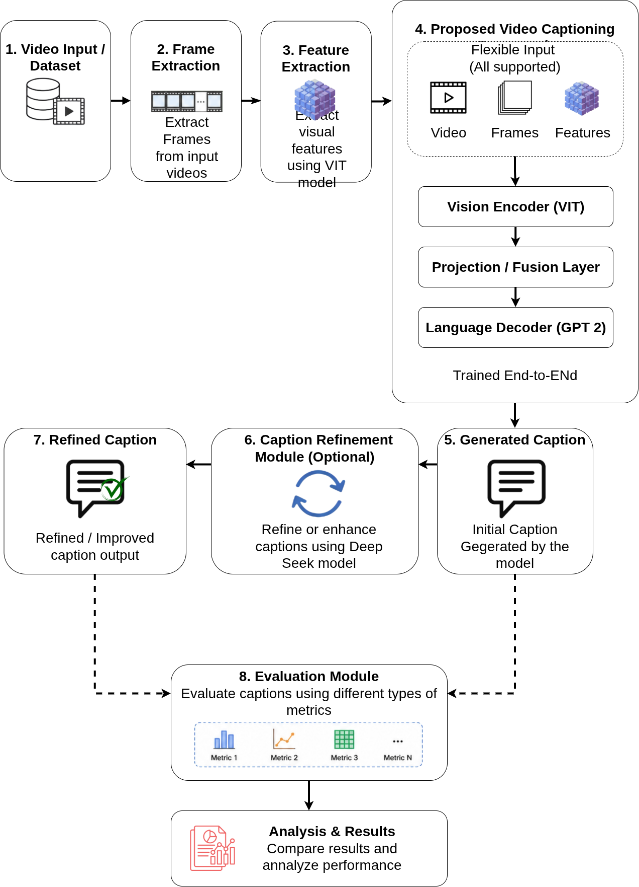
</p>

The proposed workflow consists of:

1. Video input
2. Uniform frame extraction
3. Offline visual feature extraction using ViT
4. Compact VLM caption generation
5. Optional DeepSeek caption refinement
6. Automatic evaluation using multiple captioning metrics

---

# Model Architecture

<p align="center">
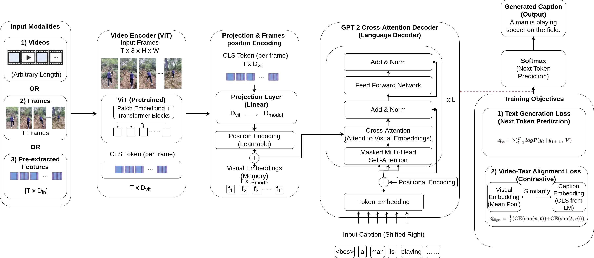
</p>

The proposed compact VLM consists of:

- **Vision Encoder:** Vision Transformer (ViT)
- **Projection Layer:** Maps visual features into the language embedding space
- **Learnable Positional Encoding**
- **Language Decoder:** GPT-2 with Cross-Attention
- **Training Objectives**
  - Caption Generation Loss
  - Video–Text Alignment Loss

---

# Video Preprocessing

To support videos of arbitrary duration, a fixed number of representative frames are uniformly sampled from each video.

<p align="center">
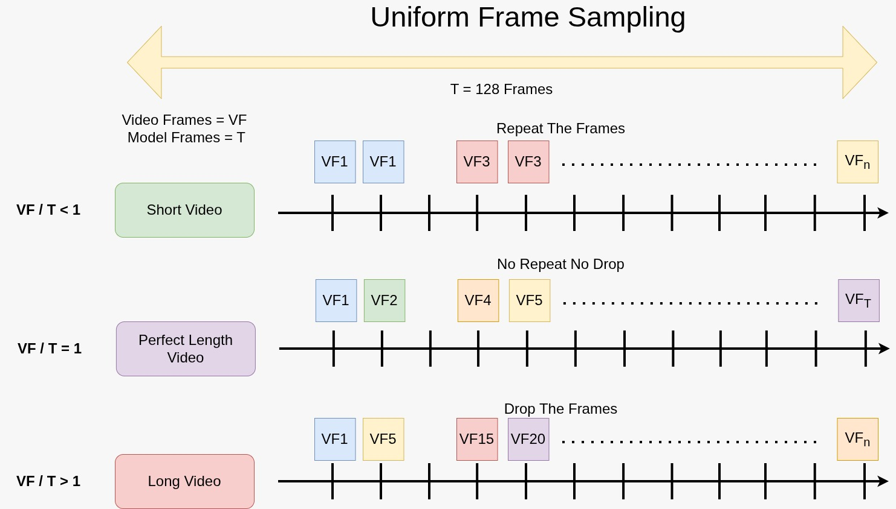
</p>

This strategy produces a consistent visual representation while avoiding unnecessary computational cost.

---

# Project Summary

| Item | Description |
|------|-------------|
| Task | Video Captioning |
| Framework | Compact Video Language Model (VLM) |
| Vision Encoder | Vision Transformer (ViT) |
| Language Decoder | GPT-2 |
| Feature Extraction | Offline Visual Features |
| Caption Refinement | DeepSeek (Optional) |
| Framework | PyTorch |
| Datasets | MSVD, MSR-VTT |

---

# Repository Description

| Path | Description |
|------|-------------|
| `CLI.py` | Command-line entry point for running individual pipeline stages. |
| `main.py` | Sequential pipeline runner for the end-to-end workflow. |
| `app.py` | Gradio interface for video upload, caption generation, and optional refinement. |
| `params.yaml` | Shared runtime parameters such as frame count, image size, batch size, and device. |
| `config/` | Dataset- and experiment-specific YAML configuration files. |
| `src/entity/` | Dataclass-based configuration entities. |
| `src/config/` | Configuration manager and training configuration defaults. |
| `src/components/` | Core implementation modules for extraction, augmentation, encoding, model training, caption generation, refinement, evaluation, and plotting. |
| `src/pipeline/` | Stage wrappers that connect configuration to each component in the workflow. |
| `src/utils/` | Shared helpers for JSON I/O, collation, checkpointing, losses, and interrupt-safe saving. |
| `requirements.txt` | Python dependencies. |
| `setup.py` | Package metadata for editable installation. |

---

# Installation

Clone the repository

```bash
git clone git@github.com:HSAkash/VideoCaptioning.git

cd VideoCaptioning
```

Install dependencies

```bash
pip install -r requirements.txt
```

---

# Training

Train the proposed model

```bash
python CLI.py --training --train_csv <training video caption csv path> --val_csv <validation video caption csv path>
```

---

# Inference

Generate captions for videos

```bash
python CLI.py --generate --source <input.mp4> --model_path <model_path.pt> 
```

## UI
```bash
python app.py
```

---

# Datasets

Experiments were conducted using two benchmark datasets.

| Dataset | Description |
|----------|-------------|
| MSVD | Microsoft Research Video Description Dataset |
| MSR-VTT | Large-scale open-domain video captioning dataset |

Please download the datasets from their official sources before training.

---

# Evaluation Metrics

The generated captions are evaluated using both traditional captioning metrics and semantic similarity metrics.

| Category | Metrics |
|----------|----------|
| N-gram Metrics | BLEU-4, METEOR, ROUGE-L |
| Semantic Metrics | CIDEr, SPICE |
| Embedding Metrics | BERTScore (Precision, Recall, F1) |
| Additional Metric | Action-Order Score |

---

# Training Curves

## MSVD

<table>
<tr>
<td align="center">
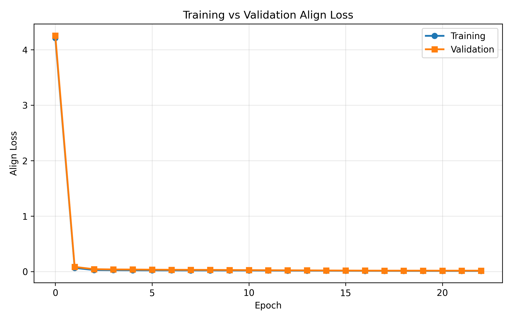<br/>
<b>Align loss</b>
</td>

<td align="center">
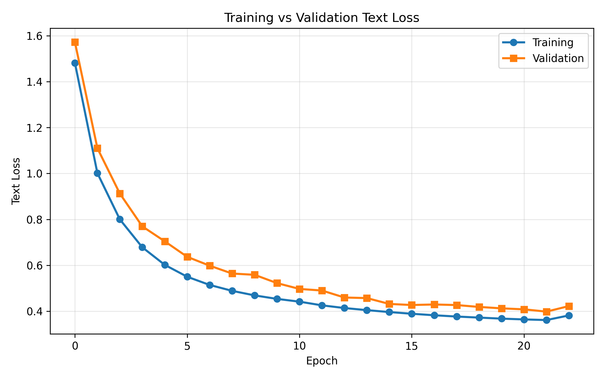<br/>
<b>Text loss</b>
</td>

<td align="center">
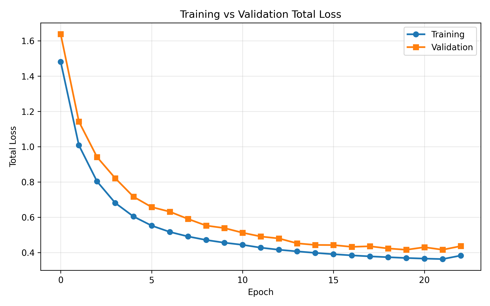<br/>
<b>Total loss</b>
</td>
</tr>
</table>

Training and validation losses show stable convergence throughout optimization.

---

## MSR-VTT

<table>
<tr>
<td align="center">
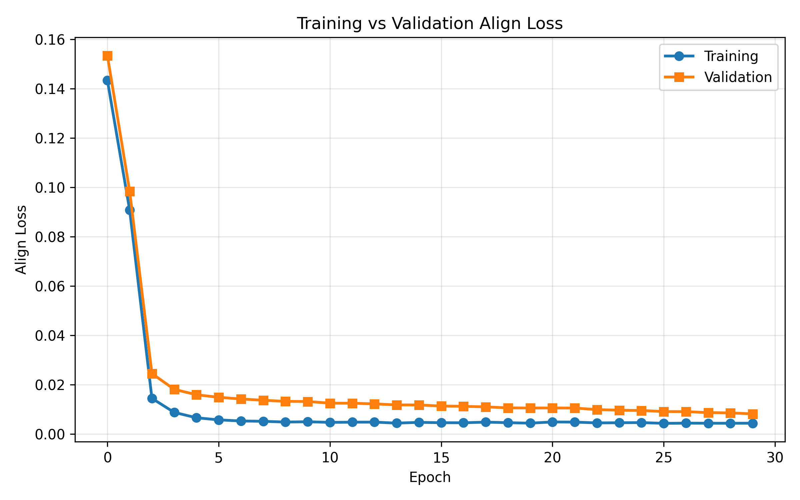<br/>
<b>Align loss</b>
</td>

<td align="center">
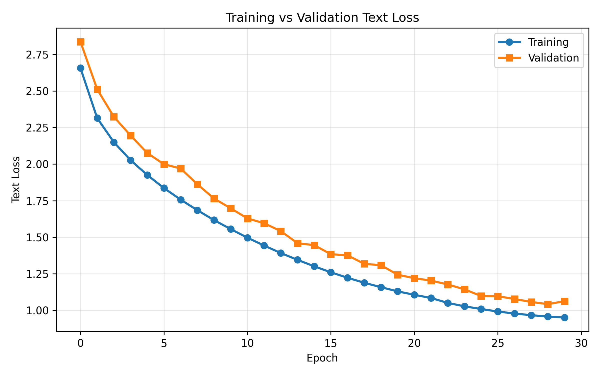<br/>
<b>Text loss</b>
</td>

<td align="center">
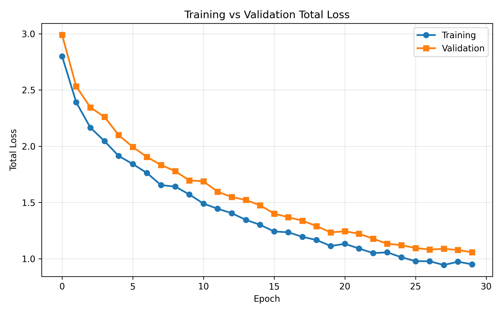<br/>
<b>Total loss</b>
</td>
</tr>
</table>

The proposed framework demonstrates consistent optimization on the larger MSR-VTT dataset.

---

# Experimental Results

## MSVD Performance

| Dataset Split | BLEU-4 | ROUGE-L | METEOR | CIDEr | SPICE | Action Order | BERTScore P | BERTScore R | BERTScore F1 |
|--------------|-------:|---------:|--------:|-------:|-------:|-------------:|------------:|------------:|-------------:|
| Train | 66.85 | 75.88 | 70.38 | 147.73 | 8.42 | 77.98 | 95.33 | 94.67 | 94.76 |
| Validation | 27.72 | 48.90 | 42.38 | 59.77 | 3.15 | 48.49 | 91.48 | 92.32 | 91.57 |
| Test | **29.79** | **50.02** | **45.08** | **53.97** | **3.70** | **46.16** | **91.93** | **92.52** | **91.95** |

---

## Caption Refinement (MSR-VTT)

| Model | BLEU-4 | ROUGE-L | METEOR | CIDEr | SPICE | BERTScore P | BERTScore R | BERTScore F1 |
|------|-------:|---------:|--------:|-------:|-------:|------------:|------------:|-------------:|
| Base VLM | 31.78 | 50.25 | 52.74 | 60.83 | 8.70 | 91.01 | 92.43 | 91.34 |
| Refined Caption | **46.39** | **58.96** | **56.50** | **63.77** | 8.35 | **93.00** | **92.89** | **92.72** |
| Improvement | **+14.61** | **+8.71** | **+3.76** | **+2.94** | −0.35 | **+1.99** | **+0.46** | **+1.38** |

---

# Qualitative Results

### MSVD

<p align="center">
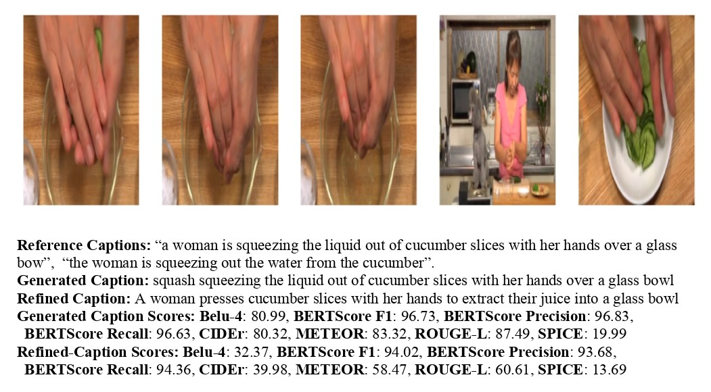
</p>

<p align="center">
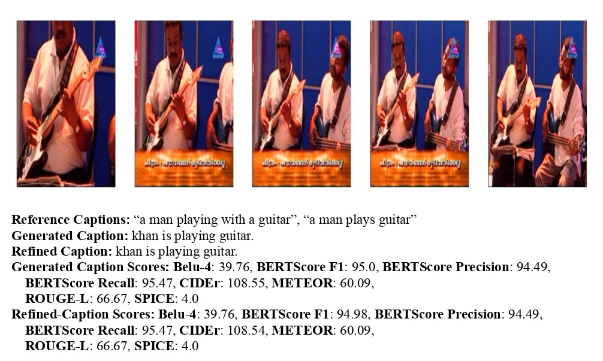
</p>

---

### MSR-VTT

<p align="center">
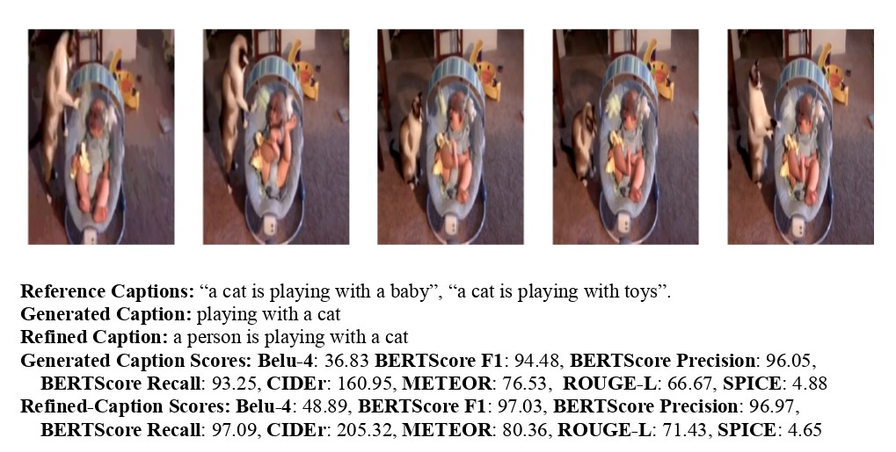
</p>

<p align="center">
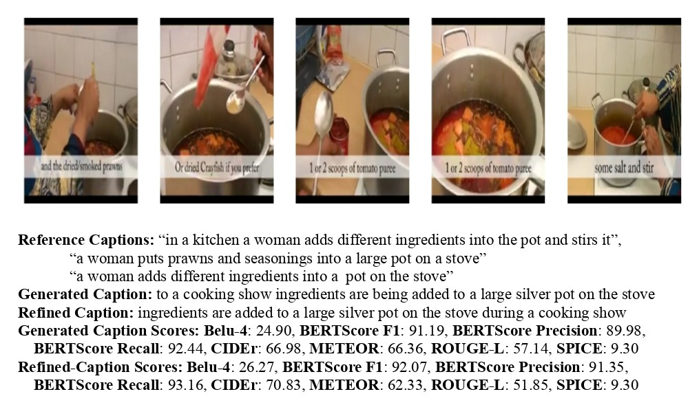
</p>

The examples illustrate the generated captions, optional refined captions, and corresponding evaluation scores.

---

# Acknowledgements

This work builds upon several outstanding open-source projects, including PyTorch, Hugging Face Transformers, Vision Transformer (ViT), GPT-2, and DeepSeek. We gratefully acknowledge the contributions of their respective developers and the creators of the MSVD and MSR-VTT benchmark datasets.

---

# License

This project is released under the MIT License.
